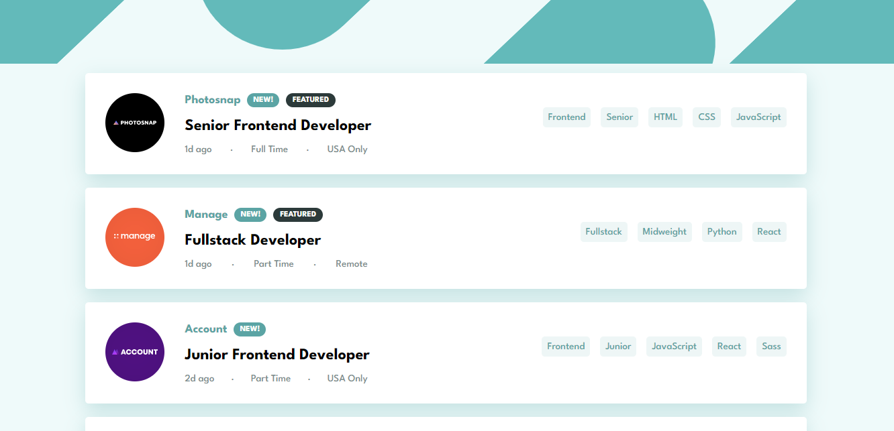
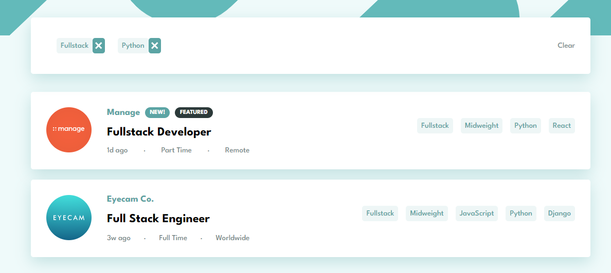
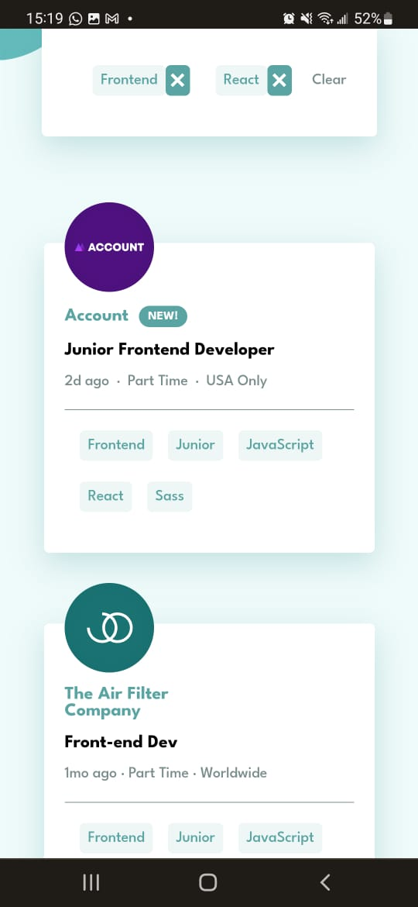

# Frontend Mentor - Job listings with filtering solution

This is a solution to the [Job listings with filtering challenge on Frontend Mentor](https://www.frontendmentor.io/challenges/job-listings-with-filtering-ivstIPCt). Frontend Mentor challenges help you improve your coding skills by building realistic projects. 

## Table of contents

- [Overview](#overview)
  - [The challenge](#the-challenge)
  - [Screenshot](#screenshot)
  - [Links](#links)
- [My process](#my-process)
  - [Built with](#built-with)
  - [What I learned](#what-i-learned)
  - [Continued development](#continued-development)
- [Author](#author)

## Overview

### The challenge

Users should be able to:

- View the optimal layout for the site depending on their device's screen size
- See hover states for all interactive elements on the page
- Filter job listings based on the categories

### Screenshot






### Links

- Solution URL: [GitHub Repository](https://github.com/tarikochuery/static-job-listing-component)
- Live Site URL: [Static List Component](https://static-job-listing-component-312nj8m84-tarikochuery.vercel.app/)

## My process

### Built with

- Flexbox
- [React](https://reactjs.org/) - JS library
- [TypeScript](https://www.typescriptlang.org/) - Programming Language

### What I learned

On this project I learned how to map through a list to render these components:

```tsx
<div className="JobsList">
  {filteredJobs.map((job, idx) => (
    <JobCard key={idx} jobData={job} />
  ))}
</div>
```

So I could understand how similar components can receive a db data through properties, and how to access these properties in order to fill the dinamic information in each child component.

### Continued development

For my next project I look forward to use styled components with TypeScript, so I can style the project by a easier way.

## Author

- Website - [Tarik Chuery](https://github.com/tarikochuery)
- Frontend Mentor - [@tarikochuery](https://www.frontendmentor.io/profile/tarikochuery)
- LinkedIn - [Tarik Chuery](https://www.linkedin.com/in/tarik-chuery/)
